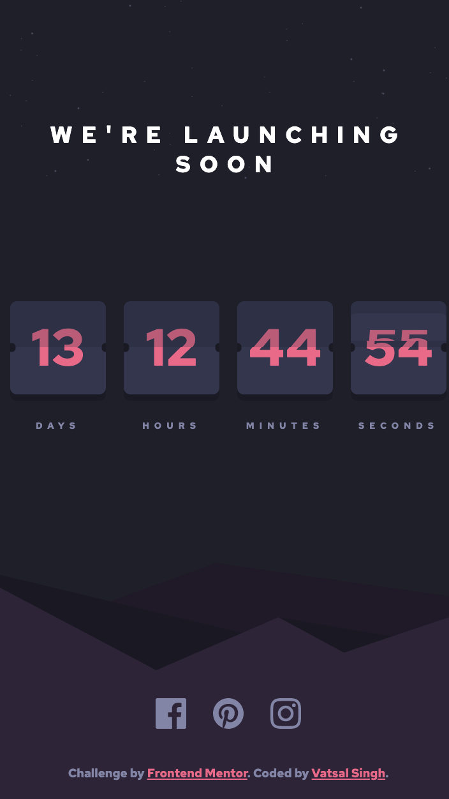

# Frontend Mentor - Launch countdown timer solution

This is a solution to the [Launch countdown timer challenge on Frontend Mentor](https://www.frontendmentor.io/challenges/launch-countdown-timer-N0XkGfyz-). Frontend Mentor challenges help you improve your coding skills by building realistic projects.

## Table of contents

- [Overview](#overview)
  - [The challenge](#the-challenge)
  - [Screenshot](#screenshot)
  - [Links](#links)
- [My process](#my-process)
  - [Built with](#built-with)
  - [What I learned](#what-i-learned)
  - [Continued development](#continued-development)
  - [Useful resources](#useful-resources)
- [Author](#author)
- [Acknowledgments](#acknowledgments)

## Overview

### The challenge

Users should be able to:

- See hover states for all interactive elements on the page
- See a live countdown timer that ticks down every second (start the count at 14 days)
- **Bonus**: When a number changes, make the card flip from the middle

### Screenshot




### Links

- Solution URL: [https://www.frontendmentor.io/solutions/launch-countdown-timer-using-flexbox-css-and-jquery-x-IA8lhNB](https://www.frontendmentor.io/solutions/launch-countdown-timer-using-flexbox-css-and-jquery-x-IA8lhNB)
- Live Site URL: [https://vatsalsinghkv.github.io/launch-countdown-timer/](https://vatsalsinghkv.github.io/launch-countdown-timer/)

## My process

### Built with

- CSS custom properties
- Flexbox
- [jQuery](https://jquery.com/) - JS library

### What I learned

I've learned lot of stuff in this challenge:

- About multiple background.

```css
body {
  background: 
  url('../images/bg-stars.svg') no-repeat, 
  url('../images/pattern-hills.svg') no-repeat 85% bottom, var(--blue-dark);

  background-size: contain, auto;
}
```

- About changing colour of SVG images.

```css
a:hover img {
	filter: 
    invert(53%) 
    sepia(39%) 
    saturate(3008%) 
    hue-rotate(312deg) 
    brightness(103%) 
    contrast(97%);
}
```

- How to use objects and destructing the objects.

```js
const $time = $('.time');

const elements = {
	daysEl: [$time[0], $time[1]],
	hoursEl: [$time[2], $time[3]],
	minsEl: [$time[4], $time[5]],
	secsEl: [$time[6], $time[7]],
};

// Function
const updateTime = (
	{ daysEl, hoursEl, minsEl, secsEl },
	{ daysTime, hoursTime, minsTime, secsTime }
) => {
	$(daysEl).text(daysTime);
	$(hoursEl).text(hoursTime);
	$(minsEl).text(minsTime);
	$(secsEl).text(secsTime);
};

// Function Call
const currentDate = new Date();

updateTime(elements, {
  daysTime: currentDate.getDate(),
  hoursTime: currentDate.getHours(),
  minsTime: currentDate.getMinutes(),
  secsTime: currentDate.getSeconds(),
});
```

- How to flip card from middle.

```js
// Function Defination
const flip = function ($el) {
	const $elClone = $el
		.clone()
		.css({
			position: 'absolute',
			top: '0',
			left: '0',
			'z-index': '10',
		})
		.prependTo($el.parent());

	setTimeout(() => $elClone.addClass('flip'));
	setTimeout(() => $elClone.fadeOut(() => $elClone.remove()));
};

//  Function Call
const $counterItemTop = $('.counter-item-top');

const counter = {
	daysEl: $($counterItemTop[0]),
	hoursEl: $($counterItemTop[1]),
	minsEl: $($counterItemTop[2]),
	secsEl: $($counterItemTop[3]),
};

flip(counter.secsEl);
```

### Continued development

### Stuff I find usefull and want to learn:

- Bootstrap
- Node.js
- Express
- React
- CSS Animations
- CSS Svg
- CSS Canvas
- JS Regular Expressipns
- Flutter & Dart

### Useful resources

- [TheNetNinja Youtube](https://www.youtube.com/c/TheNetNinja) - This helped me learn jQuery, GitHub, CSS Grid. This guy is legend there's lot of stuff to learn, which I will be learning in future.
- [GeeksForGeeks](https://www.geeksforgeeks.org/) - This is amazing website for articles, snippets, projects, algorithms etc.
- [MDN Docs](https://developer.mozilla.org/en-US/) - This is an amazing reference which helped me finally understand detailed concepts like data- attr, aria attr, input range etc.

## Author

- Frontend Mentor - [@vatsalsinghkv](https://www.frontendmentor.io/profile/vatsalsinghkv)
- Github - [@vatsalsinghkv](https://github.com/vatsalsinghkv)
- Twitter - [@vatsalsinghkv](https://www.twitter.com/vatsalsinghkv)
- Instagram - [@vatsal.sing.hkv](https://www.instagram.com/vatsal.singh.kv)
- Facebook - [@vatsalsinghkv](https://www.facebook.com/vatsal.singh.kv)

## Acknowledgments

- [Change the color of SVG image via CSS](https://hovancik.net/blog/2020/01/22/change-the-color-of-svg-image-via-css/) - This was lifesaver.
